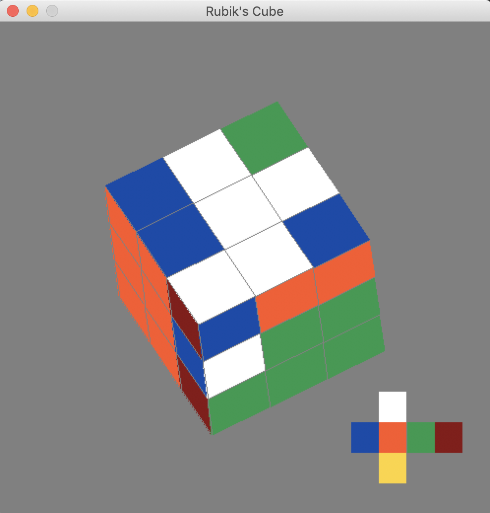

# Rubik's Cube


## Goals
* Modelling Rubik's cube in python. 
* Rendering the cube in 3D.
* Rotating the cube in 3D based on user input from keyboard and mouse.
* Visualising the rotations and moves of the cube.
* Animating transitions accompanying rotations.
* Automate solving rubik's cube by computer using known algorithms.

## User Input

```L``` is for rotating __LEFT__ face.
```R``` is for rotating __RIGHT__ face.
```U``` is for rotating __UP__ face.
```D``` is for rotating __DOWN__ face.
```F``` is for rotating __FRONT__ face.
```B``` is for rotating __BACK__ face.

```X``` is for rotating about __RIGHT__ axis.
```Y``` is for rotating about __UP__ axis.
```Z``` is for rotating about __FRONT__ axis.
 
### Modifier keys
  ``` SHIFT ``` is for anti-clockwise rotation, by default clockwise rotation.
 ```CTRL``` is for moving two layers together.
 
### Rotating the cube
  ```mouse drag``` is for rotating the cube.
  &#8592;, &#8593;, &#8594;, &#8595;, [, ] for rotating the cube using keys.
  
### Saving Cube Positions
 ```S``` is for saving current cube spatial orientation.
 ```I``` is for resetting the cube spatial orientation to previously saved orientation.
 
### Functions
```H``` is for randomly shuffling using 50 steps. 
```J``` is for solving till the next step.
```K``` is for solving the entire cube.
Pressing ```SHIFT``` along with the above keys visualizes the moves.

### Quiting
```ESC``` and ```Q``` for quiting the simulation. 

